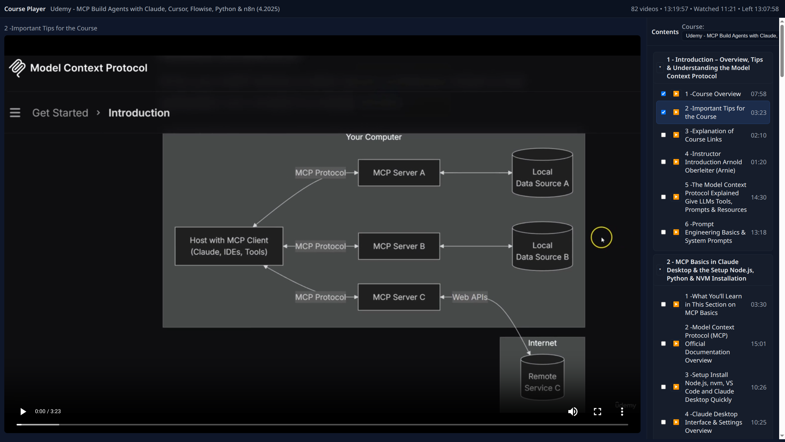

# Course Player

A minimal in-browser video player that scans a course directory, orders items numerically (e.g. `1...`, `2...`), supports nested folders as groups, streams videos with HTTP range requests, shows per-item and per-group durations, and tracks completed videos (checkbox history stored in `localStorage`).



## Features
- Numeric ordering across files and folders: `1 Intro.mp4`, `2 Setup/`, `3 Advanced/`...
- Recursive scan with groups (folders) and videos (files)
- Duration extraction via ffprobe (bundled via `ffprobe-static`), cached to `.duration-cache.json`
- Video streaming with range support
- Right-side contents list with totals and completion checkboxes
- Remembers last played and completed items in the browser

## Requirements
- Node.js 18+

## Install
```bash
npm install
```

## Prepare course directory
By default, the server scans a `courses/` directory in the project root. Create it and place your videos (and subfolders) there:

```bash
mkdir -p courses
# Put your files like: courses/1 Intro.mp4, courses/2 Basics/1 Part.mp4, ...
```

Alternatively, set an absolute directory via `COURSE_DIR`:

```bash
COURSE_DIR="/absolute/path/to/my/course" npm run dev
```

## Run
```bash
npm run dev
```
Then open `http://localhost:4000` in your browser.

## Notes
- Supported video extensions: `.mp4, .m4v, .webm, .mkv, .mov, .avi`
- Durations are cached per absolute file path in `.duration-cache.json`.
- Completion state is per-browser (stored in `localStorage`).

## Troubleshooting
- If you see an error like "COURSE_DIR does not exist":
  - Create the `courses/` folder, or
  - Set `COURSE_DIR` to a directory that exists and contains your course videos.
- If durations show as 00:00, ensure the files are readable and `ffprobe` can parse them.